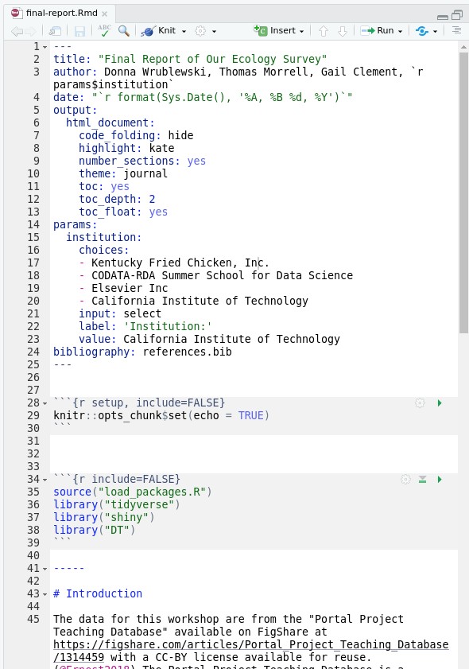
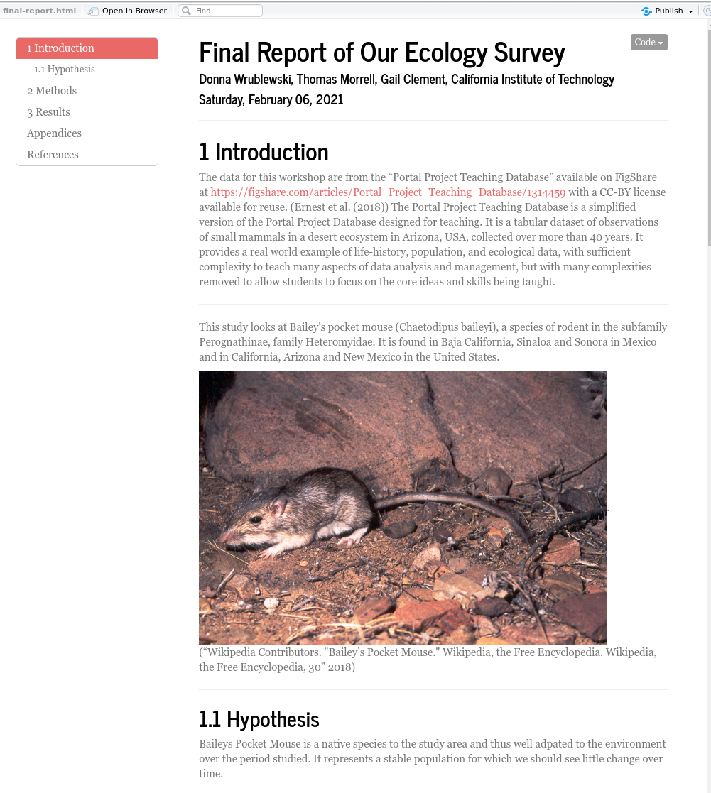
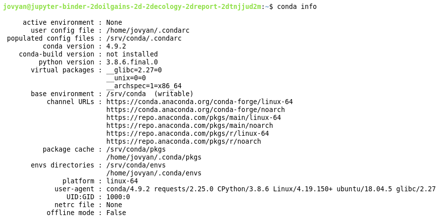
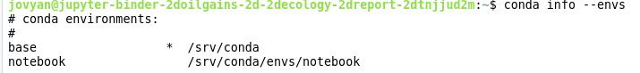

# BUILD


* Builds an RStudio environment. Anaconda included
* Installs the following packages
    ```
    install.packages("gridExtra") # Download and install gridExtra
    install.packages("hexbin") # Download and install hexbin
    install.packages("tidyverse") # Download and install tidyverse
    install.packages("lubridate")
    install.packages("readr")
    install.packages("ggplot2")
    install.packages("dplyr")
    install.packages("magrittr")
    install.packages("tidyr")
    install.packages("knitr")
    install.packages("tidyverse")
    install.packages("shiny")
    install.packages("DT")
    install.packages("rmarkdown")
    install.packages("caTools")
    install.packages("bitops")
    install.packages("rprojroot")
    ```


* R version from `2019-03-17`. See `runtime.txt`.

*   Run `final-report.Rmd` in RStudio

    

*   R-3.6.3

*   RStudio 1.2.5001

*   HTML report generated from RStudio




*   Anaconda version: 4.9.2

```
conda info
```




```
conda info --envs
```





